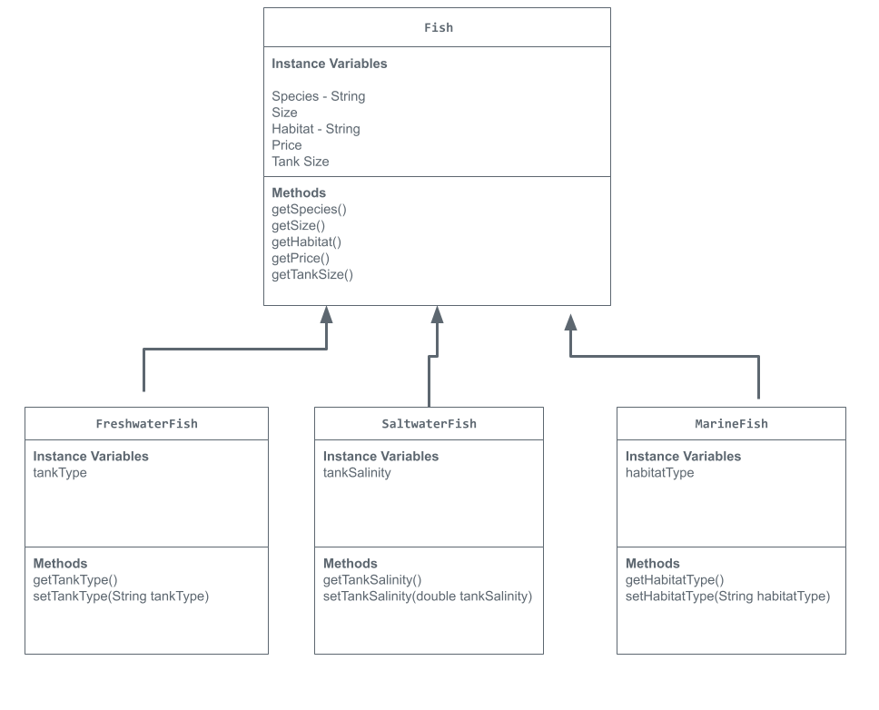

# Unit 2 - Store Management Project

## Introduction

You are opening a new business in your community! Businesses often need programs to manage the products and services they offer and track orders and requests from customers. Your goal is to create a store management system for your business.

## Requirements

Use your knowledge of object-oriented programming and class structure and design to create your store management system:
- **Create a class hierarchy** – Develop a superclass that represents a product or service your business offers and one or more subclasses that extend the superclass to represent more specific types of products or services.
- **Declare instance variables** – Declare instance variables in the superclass that are shared with the subclasses and instance variables in the subclasses that are not shared with the superclass.
- **Write constructors** – Write no-argument and parameterized constructors in the superclass and subclasses. Subclass constructors use the super keyword to call the superclass constructor.
- **Implement accessor and mutator methods** – Write accessor and mutator methods for instance variables that should be accessible and/or modifiable from outside of the class.
- **Implement a toString() method** – Write toString() methods in the superclass and subclasses that return information about the state of an object.

## UML Diagram

Put and image of your UML Diagram here. Upload the image of your UML Diagram to your repository, then use the Markdown syntax to insert your image here.

![UML Diagram for my project] 

## Description

In my project, I created a virtual fish store that displays a freshwater fish, saltwater fish, and marine fish. I was able to give information for a Guppy, Clownfish, and Lionfish from these categories. The console is able to showcases each fish's details, such as its habitat requirements, name, and pricing. I utilized object-oriented programming to build a clear framework for organizing the fish. By defining the super class "Fish", I was able to create subclasses for different types of fish that inherit common attributes while also having their *unique* properties. For instance, some fish might require specific tank conditions, while other fish requires habitat conditions. 
The main program initializes the list of fish for sale and prints out information for each one in the console. Each fish's details are structured and ordered in which allows users to understand the information and purchase a fish with the basic information provided. Overall, I chose to make a virtual fish store because of my interest in marine life and fish. I was able to inform Mr. Aiello on my interest of marine life and how I wanted to choose this topic for my project. 